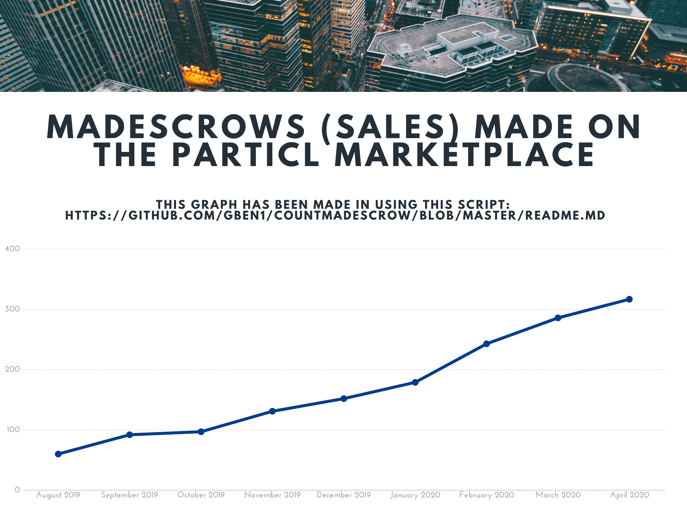
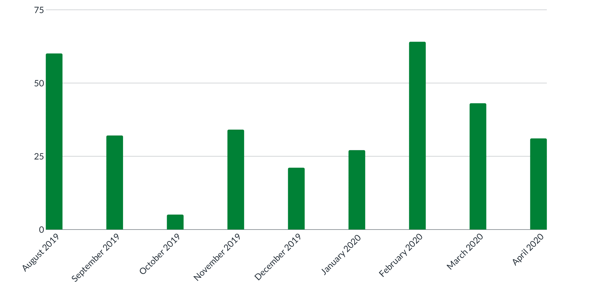
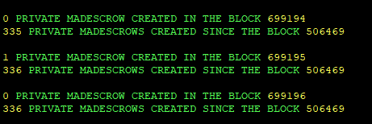
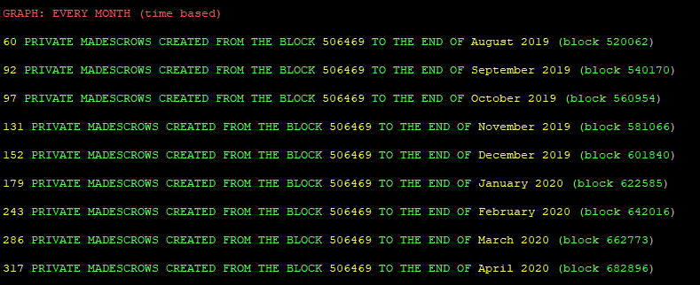

# CountMADescrow

**Mutual Assured Destruction ESCROW Counter for the Particl Marketplace:**

**MADcountV3.sh verify the following conditions to count a MADescrow:**

>"If there are 2 blind transactions in the same txid which deposit the same Multisig address in using a script there is a MADescrow in this block"

***

**Make you own graph !**

>After using this script for the first time ( `bash MADcountV3.sh`) you will be able to display the timeline (weekly/monthly/quarterly/yearly) stats of your last search in using this command: `bash displaylaststats.sh`

***

**The Reliability Index: Among the real madescrows created on the marketplace how much are corresponding with real sales and how much are fakes/tests ?**

 - Due to the very low fees on this platform it could be enough cheap to make fakes/tests madescrows on the particl marketplace (in buying your own listing for example) which could impact negatively the reliability of this script. 
 
 - The reliability index is calculated by using an algorithm based on the deviation from the statistical norm to show you the probability for each real madescrow found to be a real sale.

- To get a more accurate result it s advised to multiply the final result (number of madescrow found) by the reliability index.

- You can verify manually this index by checking on a block explorer for each madescrow found the block number of the madescrow creation and the block number of the madescrow release: if there are very few blocks between these transactions it s probably a fake/test madescrow.

>If you let `bash MADcountV3.sh` running until the end of the script and if there are at least 13000 blocks between the first and the last found you will be able to see the reliability index of your last search in entering `bash displaylaststats.sh`. 

***

## Download

`cd && git clone https://github.com/GBen1/CountMADescrow.git`

## Start the counter from block X to the latest one (X > 506468)

`bash MADcountV3.sh`

## Display the timeline stats of your last search 

`bash displaylaststats.sh`

## Check the MADescrows in a specific block

 `bash howmuchmadescrowinthisblock.sh`
 
 ## LINKS AND TUTORIALS

`cat LINKS.md`
