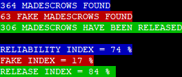
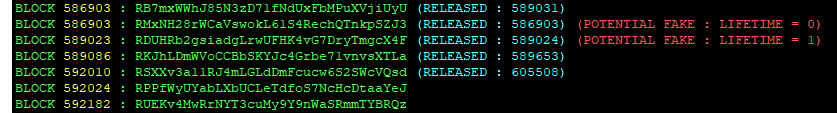
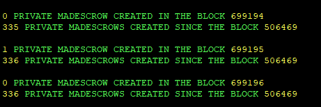
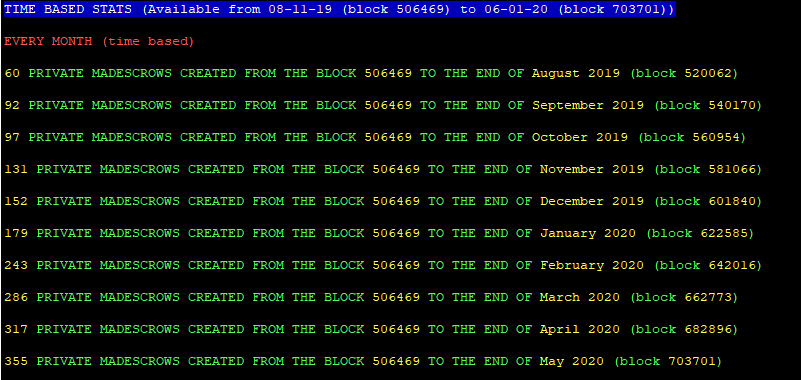

# MUTUAL ASSURED DESTRUCTION ESCROW COUNTER FOR THE PARTICL MARKETPLACE

**MADcountV4.sh verify the following conditions to count a MADescrow:**

>"If there are 2 blind transactions in the same txid which deposit the same Multisig address in using a script there is a MADescrow in this block"

***

  

  

**Timeline stats and number of MADescrow RELEASED !**

>After using this script for the first time ( `bash MADcountV4.sh`) you will be able to display three different indexes and the timeline stats (block based and time based) of your last search in using this command: `bash displaylaststats.sh`

***

**The Release Index: Among the madescrows created how much have been released ?**

>At the end of the script you will be able to see the release index of your last search in entering `bash displaylaststats.sh`. 

***

**The Reliability Index : What is the MINIMAL probability for a real madescrow found to be a real sale on the marketplace (and not a fake/test) ?**

 - Due to the very low fees on this platform it could be enough cheap to make fakes/tests madescrows on the particl marketplace (in buying your own listing for example) which could impact negatively the reliability of this script. 
 
 - The reliability index is calculated by using an algorithm based on the deviation from the statistical norm to show you the MINIMAL probability for each real madescrow found to be a real sale.

>If you let `bash MADcountV4.sh` running until the end of the script and if there are at least 13000 blocks between the first and the last madescrow found you will be able to see the reliability index of your last search in entering `bash displaylaststats.sh`. 

***

**The Fake Index: Among the real madescrows found how much are potentially fake/test/scripted ?**

- The fake index show you the % of potential fake madescrows detected among the madescrows found during you last search.

- If the number of block between the madescrow creation and the madescrow release is under than 30blocks the madescrow is considered as potentially fake (will be adjusted in a future version with an index based on the statistical norm for the Madescrow lifetimes in the considered period) as it s really unlikely that a buyer could receive his purchase and release the Madescrow less than 1 hour after the seller accepted it(create the smartcontract).

- The goal of these indexes is not to be 100% accurate but to give us the most important % of good metrics to analyse the evolution of this project

>If you let `bash MADcountV4.sh` running until the end of the script you will be able to see the fake index of your last search in entering `bash displaylaststats.sh`. 

***

**The Margin of Error**

- The difference between the fake index and the reliability index represent the margin of error about fake sales considered as true or real sales considered as fake.

> Margin of error = 100 - (reliability index + fake index)

***

**Browse all the stats from August 2019 to the end of May 2020 without the need to run the script**

> [STATS: BLOCK 506469 -> BLOCK 705736](https://github.com/GBen1/CountMADescrow/tree/master/BENSTATS)

***

## Download

`cd && git clone https://github.com/GBen1/CountMADescrow.git`

## Start the counter from block X to the block Y  (506469 <= X < Y <= Highest Block)

`cd CountMADescrow && bash MADcountV4.sh`

  

## Display the timeline stats of your last search 

`bash displaylaststats.sh`

  

 
 ## LINKS AND TUTORIALS

`cat LINKS.md`
