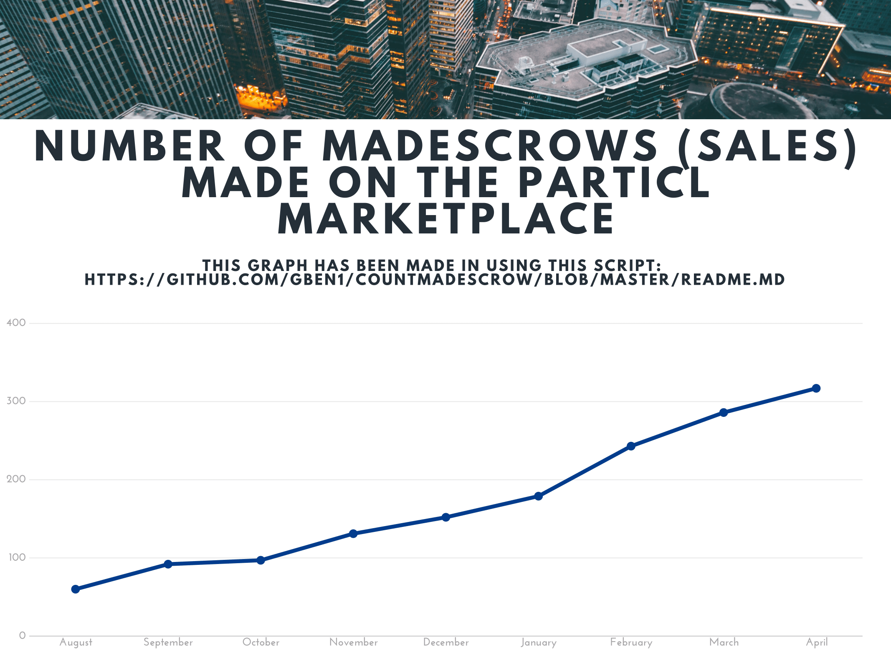

# CountMADescrow

**Mutual Assured Destruction ESCROW Counter for the Particl Marketplace:**

**MADcountV3.sh verify the following conditions to count a MADescrow:**

>"If there are 2 blind transactions in the same txid which deposit the same Multisig address in using a script there is a MADescrow in this block"

***

**Make you own graph !**

>After using this script for the first time ( `bash MADcountV3.sh`) you will be able to display the timeline (weekly/monthly/quarterly/yearly) stats of your last search in using this command: `bash displaylaststats.sh`

***

## Download

`cd && git clone https://github.com/GBen1/CountMADescrow.git`

## Start the counter from block X to the latest one (X > 506468)

`bash MADcountV3.sh`

## Display the timeline stats of your last search (very useful to make your own graphs)

`bash displaylaststats.sh`

## Check the MADescrows in a specific block

 `bash howmuchmadescrowinthisblock.sh`
 
 ## LINKS AND TUTORIALS

`cat LINKS.md`
