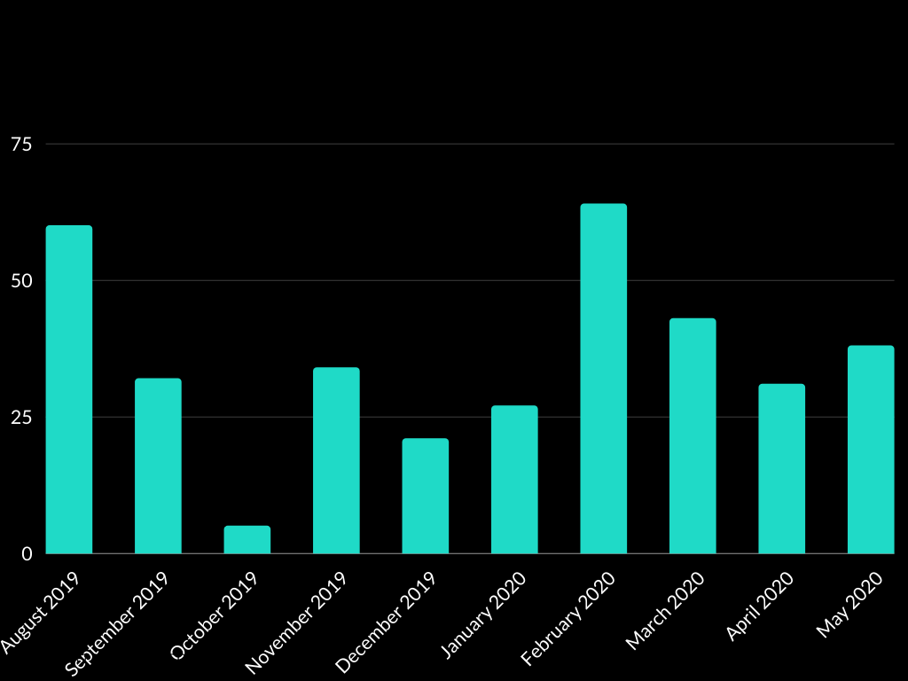
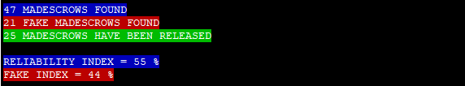

# MUTUAL ASSURED DESTRUCTION ESCROW COUNTER FOR THE PARTICL MARKETPLACE

**MADcountV3.sh verify the following conditions to count a MADescrow:**

>"If there are 2 blind transactions in the same txid which deposit the same Multisig address in using a script there is a MADescrow in this block"

***

**Timeline stats and number of MADescrow RELEASED !**

>After using this script for the first time ( `bash MADcountV3.sh`) you will be able to display the number of madescrow released and the timeline (weekly/monthly/quarterly/yearly) stats of your last search in using this command: `bash displaylaststats.sh`

***

**The Reliability Index : What is the MINIMAL probability for a madescrow found to be a real sale on the marketplace (and not a fake/test) ?**

 - Due to the very low fees on this platform it could be enough cheap to make fakes/tests madescrows on the particl marketplace (in buying your own listing for example) which could impact negatively the reliability of this script. 
 
 - The reliability index is calculated by using an algorithm based on the deviation from the statistical norm to show you the MINIMAL probability for each real madescrow found to be a real sale.

>If you let `bash MADcountV3.sh` running until the end of the script and if there are at least 13000 blocks between the first and the last madescrow found you will be able to see the reliability index of your last search in entering `bash displaylaststats.sh`. 

***

**The Fake Index: Among the madescrows found how much are fake/test/scripted sale ?**

- The fake index show you the % of fake madescrows among the madescrows found during you last search.

>If you let `bash MADcountV3.sh` running until the end of the script you will be able to see the fake index of your last search in entering `bash displaylaststats.sh`. 

## Download

`cd && git clone https://github.com/GBen1/CountMADescrow.git`

## Start the counter from block X to the block Y  (506469 <= X < Y <= Highest Block)

`bash MADcountV3.sh`

## Display the timeline stats of your last search 

`bash displaylaststats.sh`

## Check the MADescrows in a specific block

 `bash howmuchmadescrowinthisblock.sh`
 
 ## Check how this script is going to be improved
 
  `cat ROADMAP.md`
 
 ## LINKS AND TUTORIALS

`cat LINKS.md`
