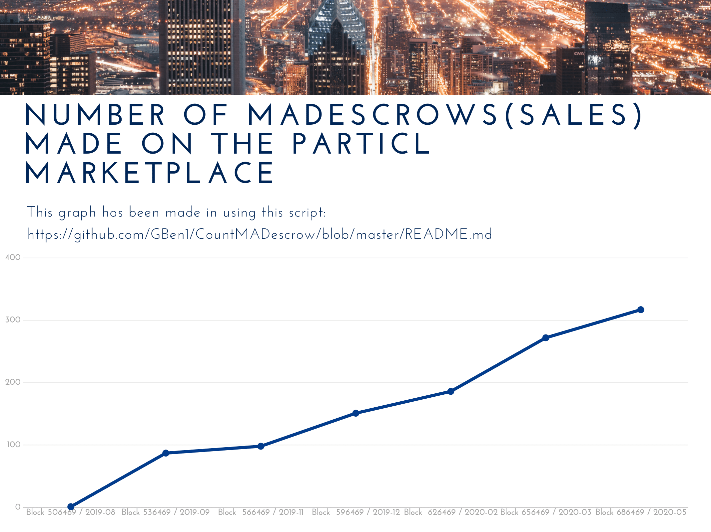
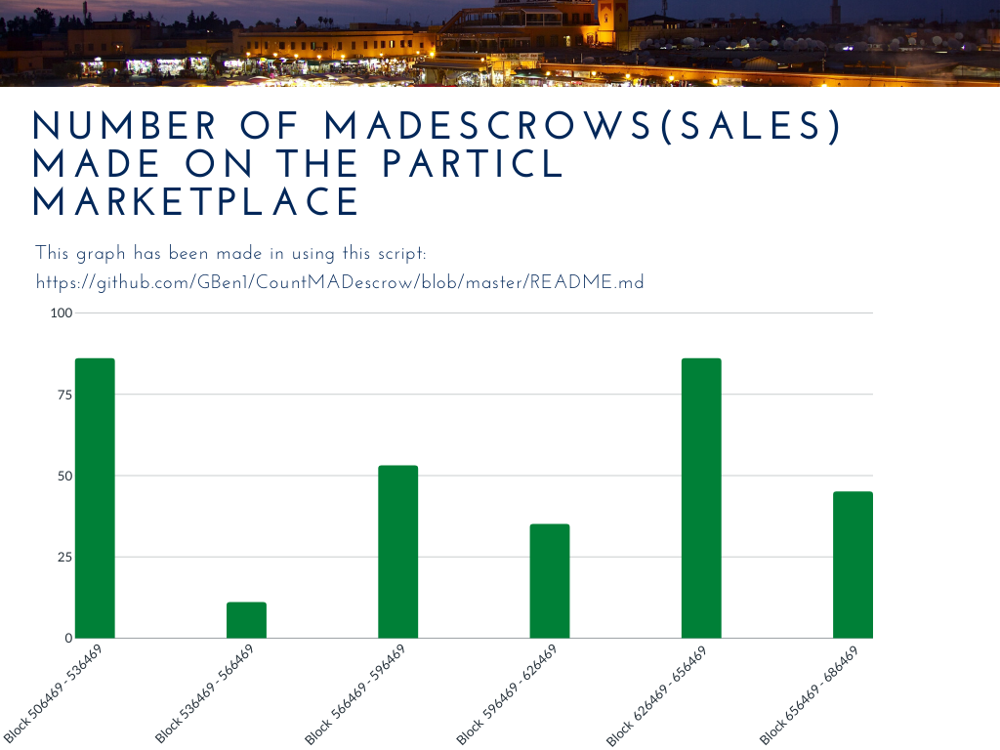
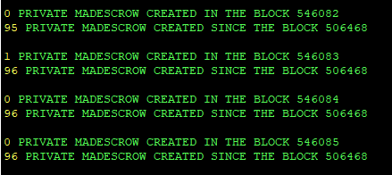

# CountMADescrow

**Mutual Assured Destruction ESCROW Counter for the Particl Marketplace:**

**MADcount.sh verify the following conditions to count a MADescrow: **

"If there are 2 blind transactions in the same block which deposit a Multisig address there is a MADescrow in this block"

**MADcountV2.sh is a more accurate but it also takes more time, MADcountV2.sh verify the following conditions to count a MADescrow: ** 

"If there are 2blind transactions in the same txid which deposit the same Multisig address there is a MADescrow in this block"

## Download

`git clone https://github.com/GBen1/CountMADescrow.git`

## Start the counter from block X to the latest one (X >= 506468)

`bash MADcount.sh` OR `bash MADcountV2.sh`

## Check the MADescrows in a specific block

 `bash howmuchmadescrowinthisblock.sh`
 
 ## LINKS AND TUTORIALS

`cat LINKS.md`
